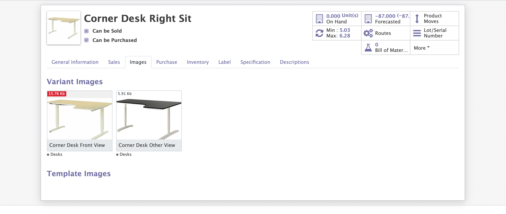
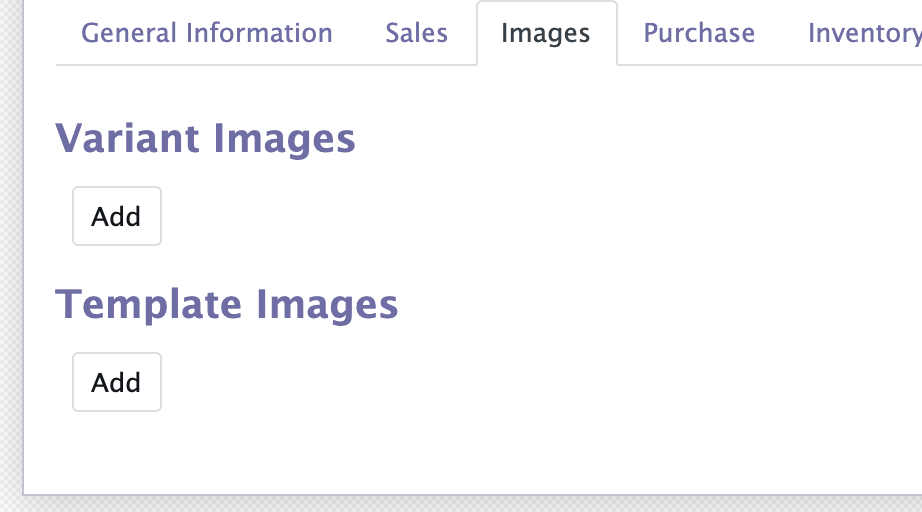
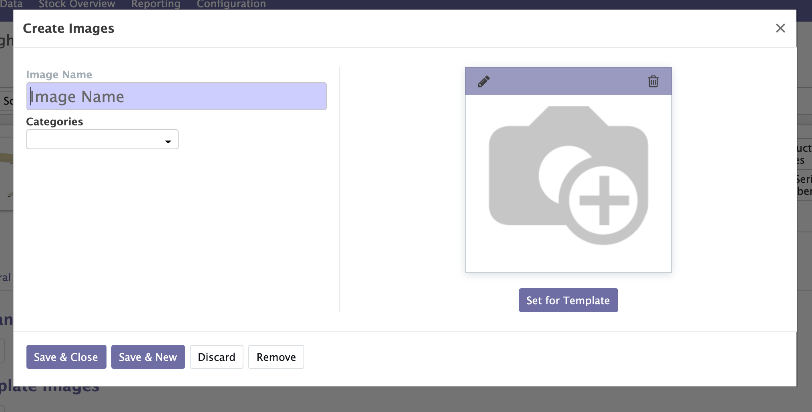
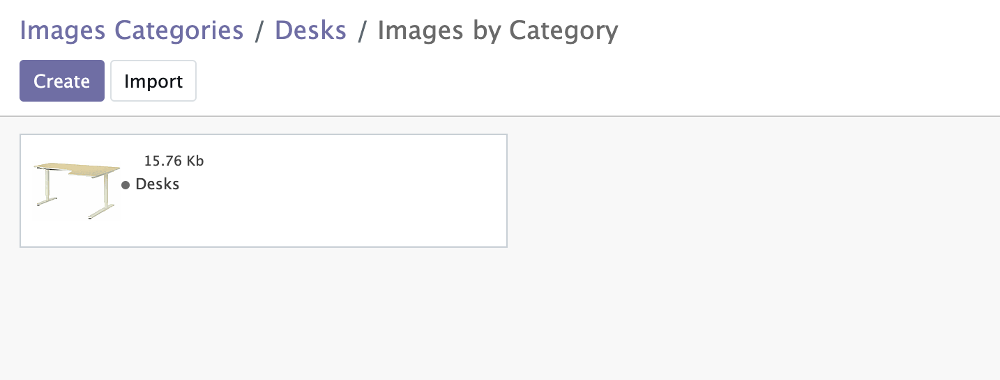

<a href="https://www.odoo.com/documentation/12.0/index.html">
</img>
</a>
<a href="https://www.alliantum.com">
</img>
</a>
<a href="http://www.gnu.org/licenses/agpl-3.0-standalone.html">
</img>
</a>
</img>

<h1>Multiple Images</h1>
Creates an image gallery section available on every product and also on the product templates.

***
***
***

# Usage

Install this add-on and it will be automatically ready to use it.

Now if you take a look at any product form you will see a new menu `Images`. Then click it and there you must see something like this:

  

Now if you want to add a new image it's fairly simple even though you are in a product variant or in a product template.

  

You can also create common categories of images for different products!

  

# Improvements

With this library you will be able to have a gallery of images of any product (Variant and Template). This way you don't need to use some external cloud services provider.

# Contributors

- [Alliantum](https://www.alliantum.com)

